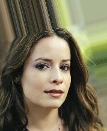
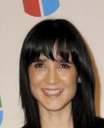

# Gender-classification-celebs
Gender classification model (celebrity images)

## About the dataset
The data set is of images of male and female celebreties. It is split into training, testing and validation directory. The dataset consists of almost 200K images which are almost 1.3GB in size.

## Example images from the dataset
</img> 
</img> 
</img> 
</img> 

</img> 
</img>
</img> 
</img> 

## Implementation accuracy
--> Data Augmentation Not implemented

<b>Train set accuracy:</b> 98.70 % 
<b>Validation set accuracy :</b> 97.78 % 
<b>Test set accuracy:</b> 97.51 % 

The model was trained for 10 epochs. The model performance is acceptable and  With a bit more of models layers, dropouts, batch normalization, increasing the number of filters etc and training the model for 30 to 40 epochs or more will result in even better accuracy.

## The following plots and charts were made to understand the model beter.

<b>Loss vs Epochs</b>

</img> 

<b>Binary accuracy vs Epochs</b>

</img> 
